# 🚁 DroneHire\_ | Neo-Brutalist Aerial Operations Platform

> **"Uncompromised aerial data delivery and operational superiority."**

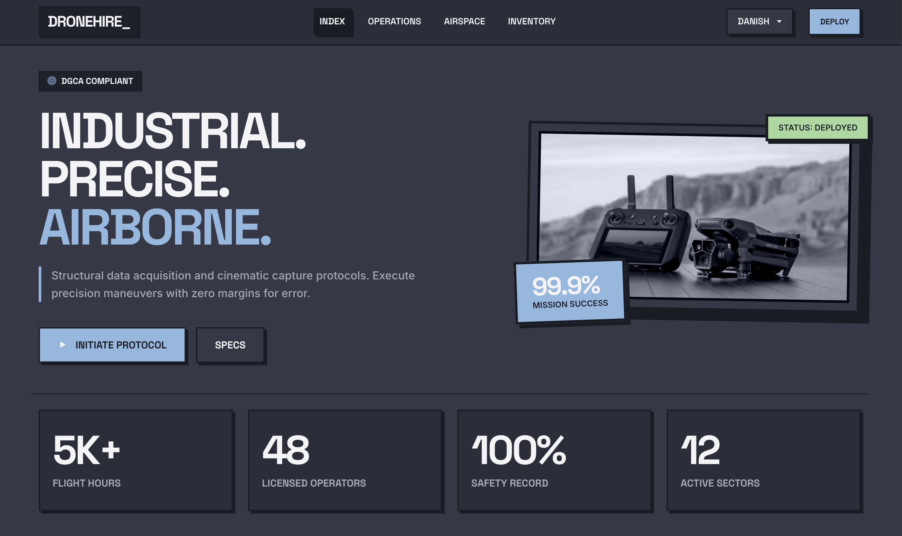

## 📋 Overview

**DroneHire** is a premium, tactical-themed web platform designed for deploying professional drone operations. Deviating from standard corporate websites, DroneHire embraces a stark, high-contrast **Neo-Brutalist** design aesthetic. It prioritizes raw functionality, structural grids, heavy typography, and a "mission control" user experience to make drone booking feel like initiating a specialized tactical deployment.

---

## ✨ Core Features

- **⚡ Neo-Brutalist UI/UX:** High-contrast borders, harsh shadows, Space Grotesk typography, and tactical micro-interactions.
- **🎯 Operations Menu:** Intuitive selection of specialized drone missions (Cinematics, Topography, Real Estate, Custom Ops) with variable base constraints.
- **🌐 Zonal Airspace Engine:** Live DGCA airspace restriction simulations. Enter your operational Zip/PIN Code to instantly verify if an area is a strict **Red Zone**, controlled **Yellow Zone**, or unrestricted **Green Zone**.
- **🚀 Dynamic Deployment Flow:** Fully functional deployment booking system, complete with chronological scheduling, drone-type recommendations based on mission profile, and automatic cost calculations.
- **📄 Tactical Reporting:** One-click instant PDF invoice generation utilizing `jsPDF` for finalized mission deployments.
- **🧰 Inventory Matrix:** A detailed catalog of available operational hardware (DJI Mavic 3 Pro, Inspire 3, Matrice 350 RTK, etc.) featuring live status indicators and telemetry specs.
- **🛡️ Operator Dashboard:** Role-based clearance dashboard allowing simulated users to track active missions, review historical deployments, and manage their status.

---

## 🛠️ Technical Architecture

This application is built focusing on vanilla performance, leaning strictly on foundational web languages rather than heavy JavaScript frameworks.

- **Core:** HTML5, Vanilla CSS3, Vanilla ES6 JavaScript
- **Layout Framework:** Bootstrap 5 (utilized strictly for structural grids out of the box, with heavy custom CSS overrides to enforce brutalism).
- **Iconography:** Bootstrap Icons (BI)
- **Notifications:** SweetAlert2 for tactile, stylized alerts.
- **Chronology:** Flatpickr for streamlined, dark-mode date selection.
- **PDF Generation:** jsPDF for client-side document rendering.
- **State Management:** Native `localStorage` for maintaining simulated user sessions and deployment history without a backend.

---

## 📸 Platform Showcase & Code Architecture

_A deep dive into the DroneHire interface and the underlying source code._

<details>
<summary><b>View Interface Gallery (Website Screenshots)</b></summary>
<br>


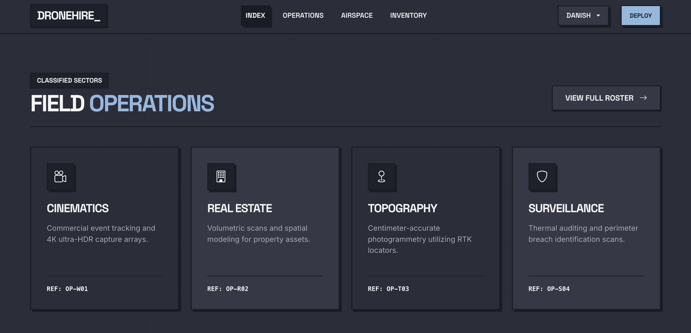
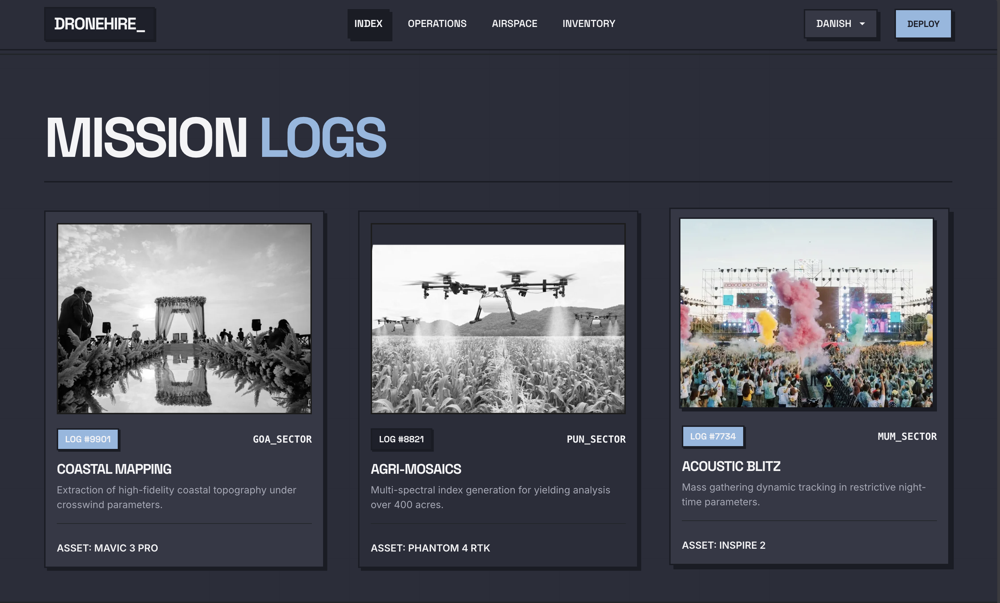
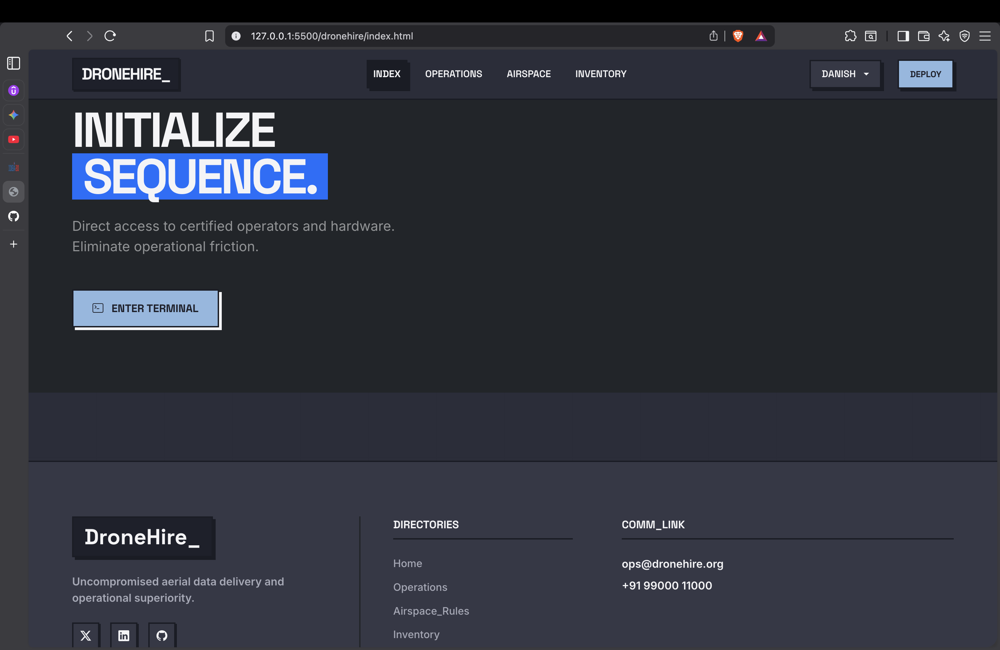
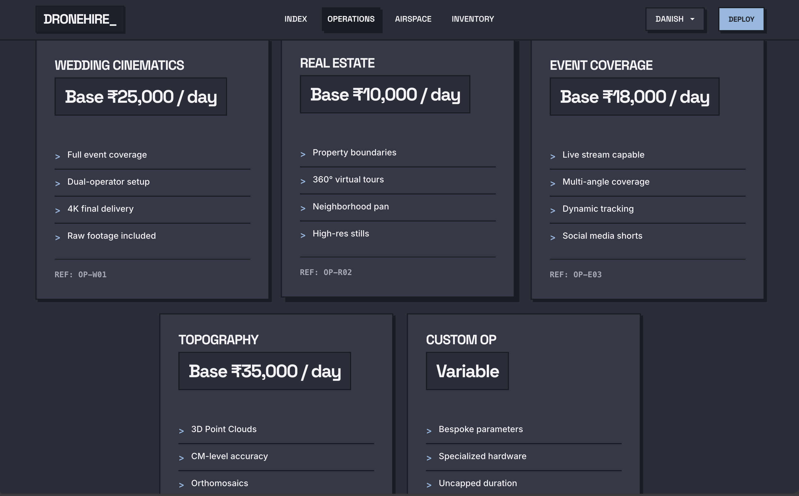
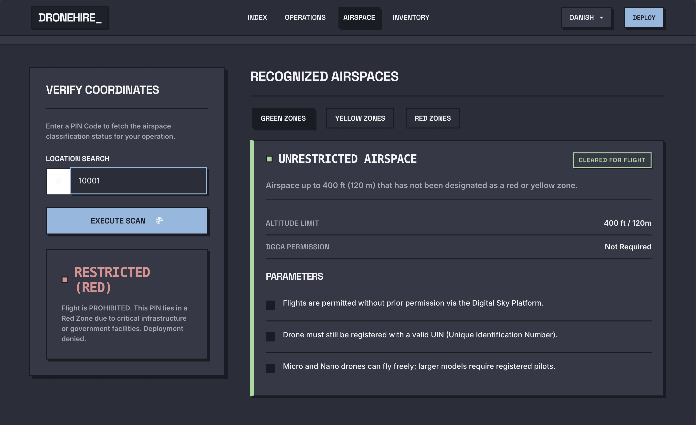
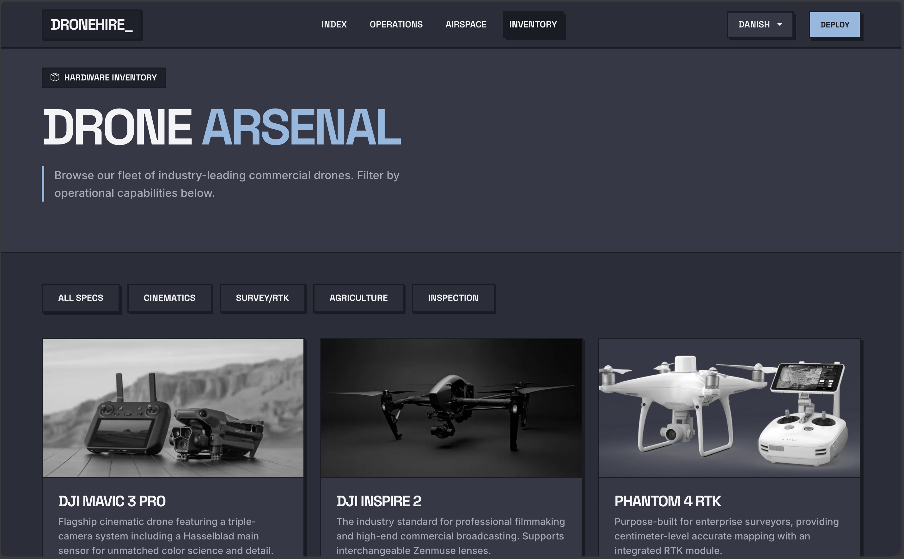
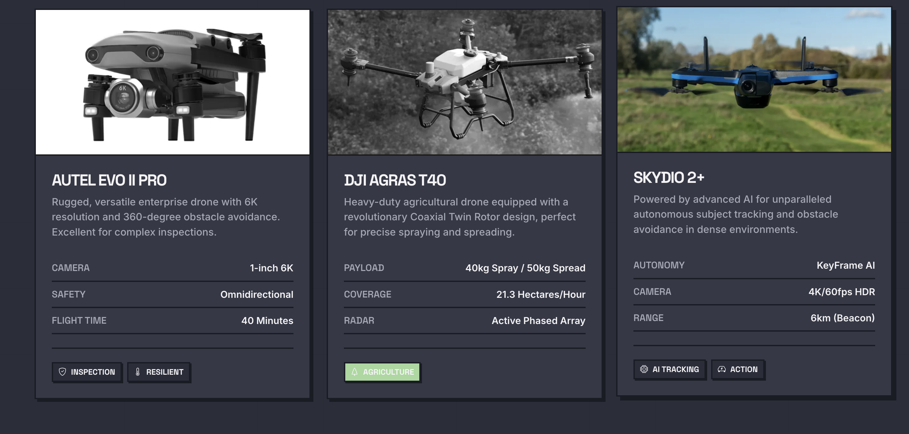

</details>

<details>
<summary><b>View Architecture Gallery (Code Screenshots)</b></summary>
<br>

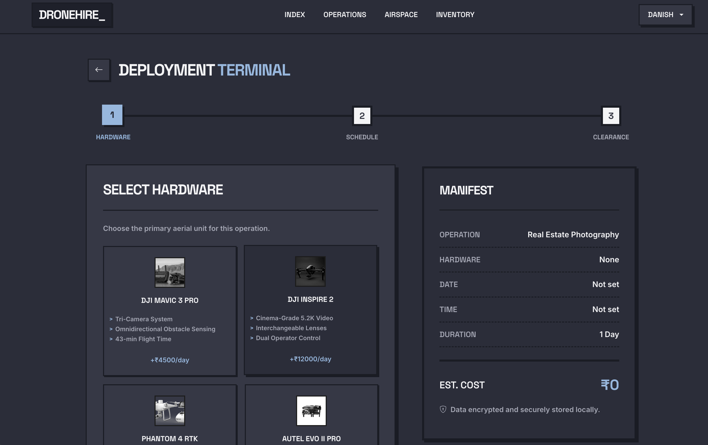
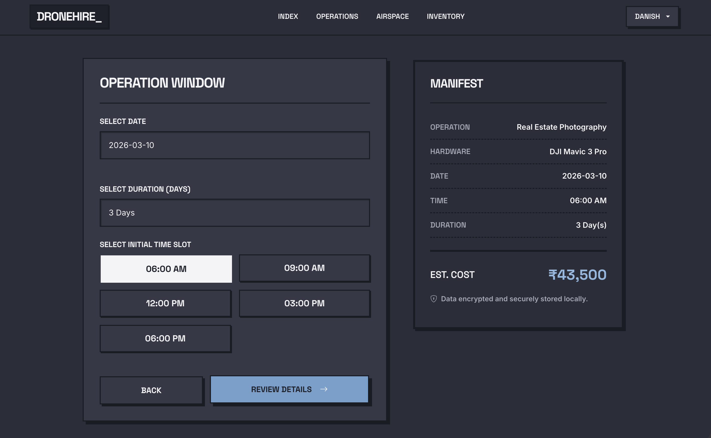
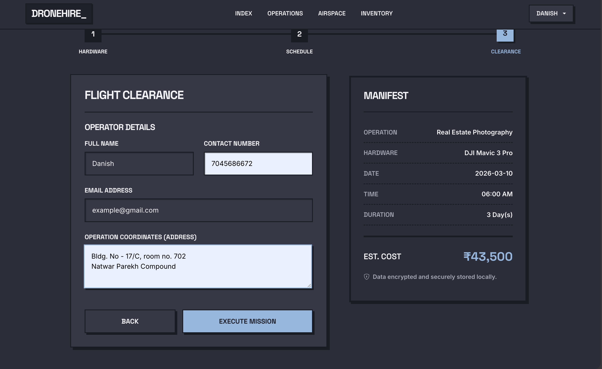
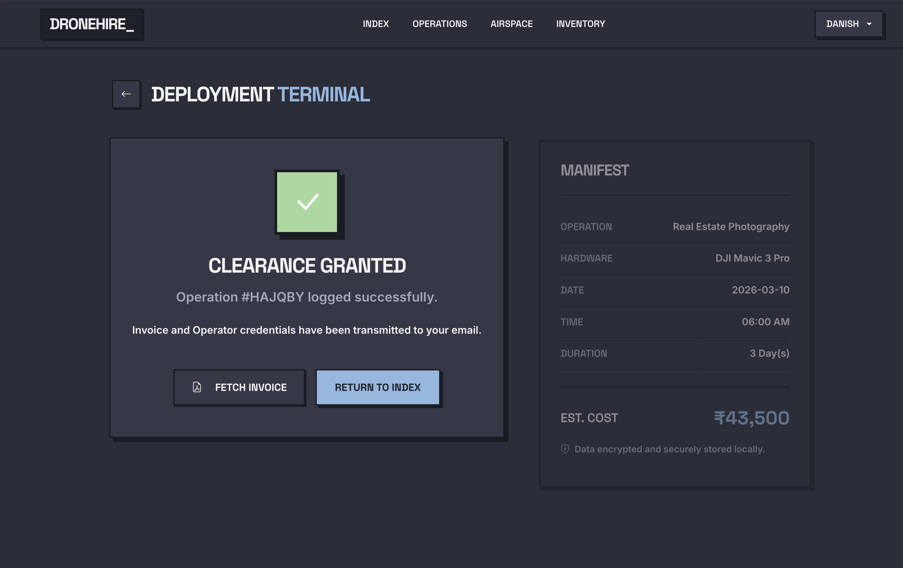
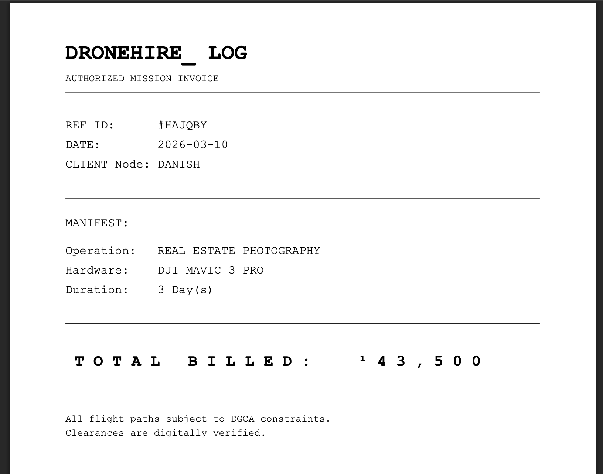
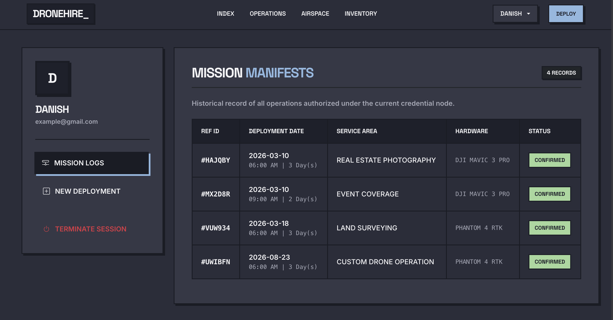
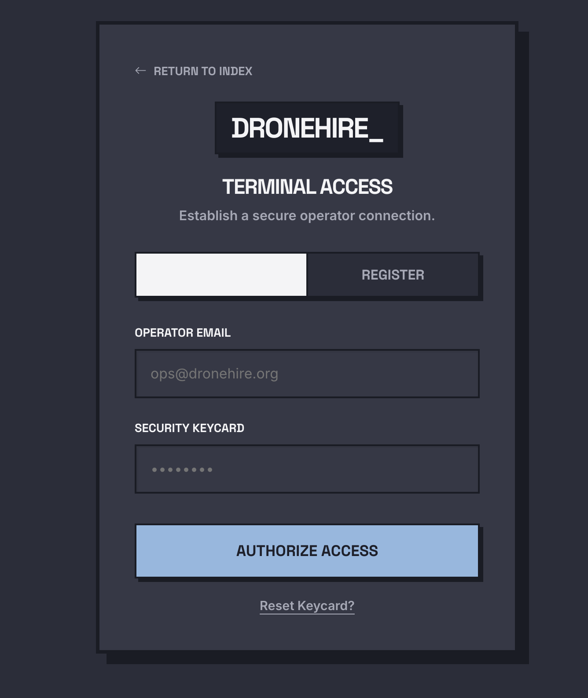
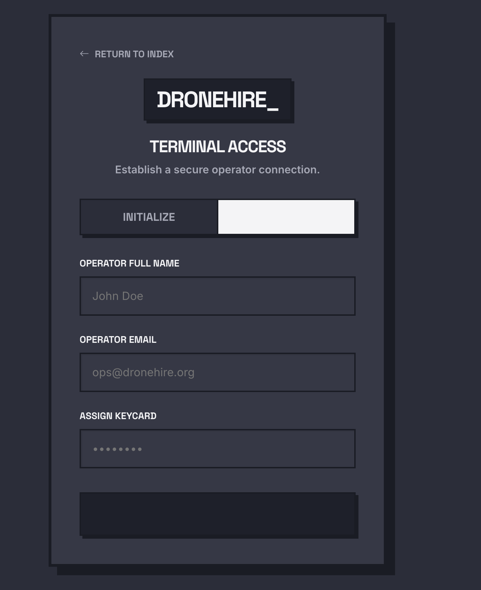

</details>

---

## 💻 Local Installation & Deployment

DroneHire runs entirely client-side. No complex build tools or package managers are strictly required for the core application.

1. **Clone the Repository:**
   ```bash
   git clone https://github.com/your-username/dronehire.git
   ```
2. **Navigate:**
   ```bash
   cd dronehire
   ```
3. **Execute:**
   Open `index.html` directly in any modern web browser to initialize the platform locally. Alternatively, use a live server extension (like VSCode Live Server) for hot-reloading.

---

## 🔒 Security & Data

- **Authorization:** The app utilizes a simulated frontend authentication wrapper.
- **Data Persistence:** User credentials and booking records are stored selectively in `localStorage` under `dronehire_current_user` and `dronehire_bookings`.
- _Note: This platform is currently configured as a frontend prototype. A secure backend environment (Node.js/Python) would be required for production transaction processing._

---

_Developed as a high-concept frontend UI/UX architecture._
